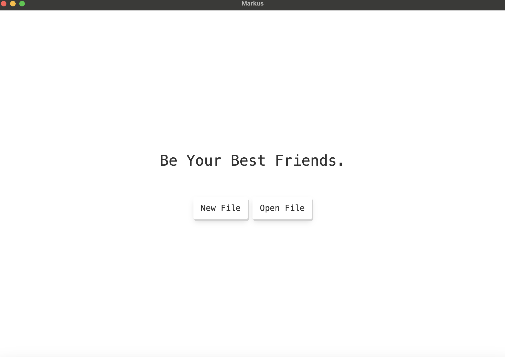
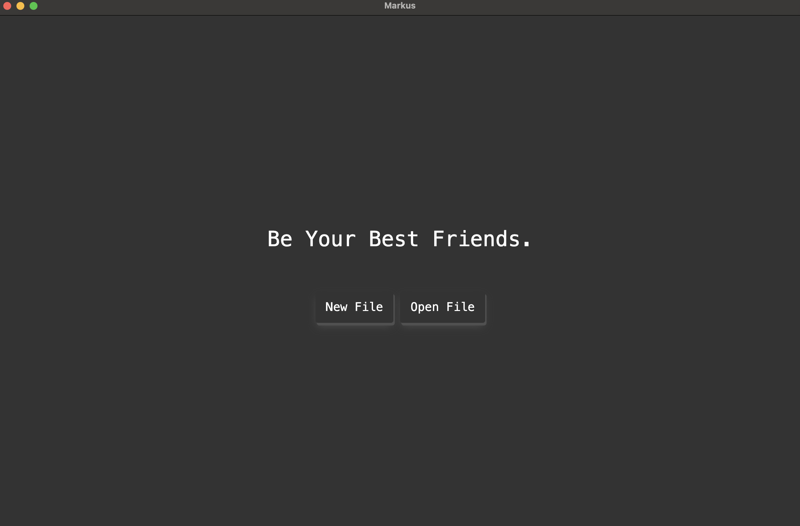

# Markdown Editor

A feature-rich Markdown editor with a variety of useful features for a smooth writing and editing experience.

## Features

- **Markdown Shortcuts**: Supports keyboard shortcuts for efficient Markdown editing.
- **File Management**: Allows opening and creating new files seamlessly.
- **Search Functionality**: Easily search within a single file.
- **Inline Equations**: Support for inline mathematical formulas.
- **Light/Dark Theme**: Switch between light and dark themes for comfortable reading and writing.
- **Export Options**: Export your work as PDF or HTML files.
- **Editor Pinning**: Option to pin the editor for a persistent workspace.
- **Code Syntax Highlighting**: Supports various syntax highlighting styles for different programming languages.
- **Free**: The editor is completely free to use.

## Screenshot
### Light Mode


### Dark Mode


## Keyboard Shortcuts

Here are the available keyboard shortcuts for the editor:

### Edit Mode
- **Bold**: `Cmd + B` (Mac) / `Ctrl + B` (Windows/Linux)
- **Italic**: `Cmd + Shift + I` (Mac) / `Ctrl + Shift + I` (Windows/Linux)
- **Strikethrough**: `Cmd + Shift + S` (Mac) / `Ctrl + Shift + S` (Windows/Linux)
- **Underline**: `Cmd + Shift + U` (Mac) / `Ctrl + Shift + U` (Windows/Linux)
- **Code Block**: `Cmd + \`` (Mac) / `Ctrl + \`` (Windows/Linux)
- **Inline Code**: `Cmd + Shift + \`` (Mac) / `Ctrl + Shift + \`` (Windows/Linux)

### Lists & Structure
- **Unordered List**: `Cmd + Shift + L` (Mac) / `Ctrl + Shift + L` (Windows/Linux)
- **Ordered List**: `Cmd + Shift + O` (Mac) / `Ctrl + Shift + O` (Windows/Linux)
- **Block Quote**: `Cmd + Shift + Q` (Mac) / `Ctrl + Shift + Q` (Windows/Linux)

### Headings
- **Heading 1**: `Cmd + Shift + 1` (Mac) / `Ctrl + Shift + 1` (Windows/Linux)
- **Heading 2**: `Cmd + Shift + 2` (Mac) / `Ctrl + Shift + 2` (Windows/Linux)
- **Heading 3**: `Cmd + Shift + 3` (Mac) / `Ctrl + Shift + 3` (Windows/Linux)
- **Heading 4**: `Cmd + Shift + 4` (Mac) / `Ctrl + Shift + 4` (Windows/Linux)
- **Heading 5**: `Cmd + Shift + 5` (Mac) / `Ctrl + Shift + 5` (Windows/Linux)
- **Heading 6**: `Cmd + Shift + 6` (Mac) / `Ctrl + Shift + 6` (Windows/Linux)

### Insertions
- **Insert Link**: `Cmd + Shift + K` (Mac) / `Ctrl + Shift + K` (Windows/Linux)
- **Insert Image**: `Cmd + Shift + P` (Mac) / `Ctrl + Shift + P` (Windows/Linux)

### Other
- **Undo**: `Cmd + Z` (Mac) / `Ctrl + Z` (Windows/Linux)
- **Redo**: `Cmd + Shift + Z` (Mac) / `Ctrl + Shift + Z` (Windows/Linux)

Use these shortcuts to quickly format and insert content in the editor!


## Build Icon

```shell
sudo ./node_modules/.bin/electron-icon-maker --input=/path/to/icon.png --output=/path/to/icons/
```

## License

This project is licensed under the MIT License.
