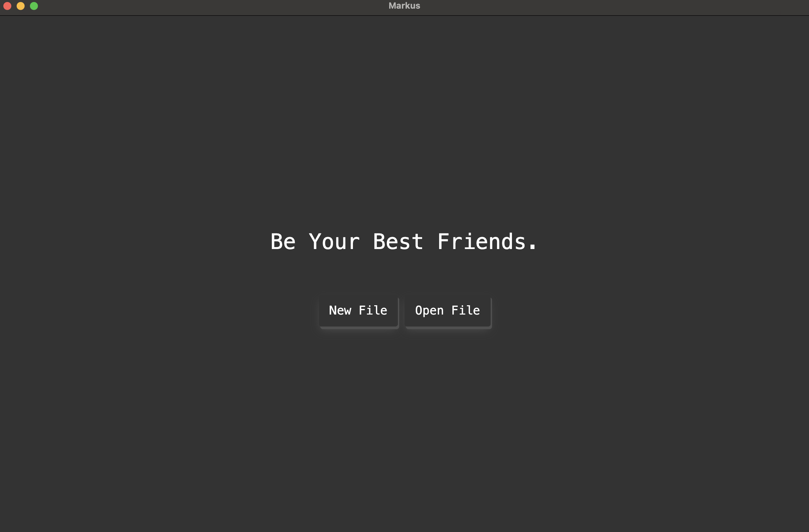

# Markdown Editor

A feature-rich Markdown editor with a variety of useful features for a smooth writing and editing experience.

## Features

- **Markdown Shortcuts**: Supports keyboard shortcuts for efficient Markdown editing.
- **File Management**: Allows opening and creating new files seamlessly.
- **Search Functionality**: Easily search within a single file.
- **Inline Equations**: Support for inline mathematical formulas.
- **Light/Dark Theme**: Switch between light and dark themes for comfortable reading and writing.
- **Export Options**: Export your work as PDF or HTML files.
- **Editor Pinning**: Option to pin the editor for a persistent workspace.
- **Code Syntax Highlighting**: Supports various syntax highlighting styles for different programming languages.
- **Free**: The editor is completely free to use.

## Screenshot

## License

This project is licensed under the MIT License.
